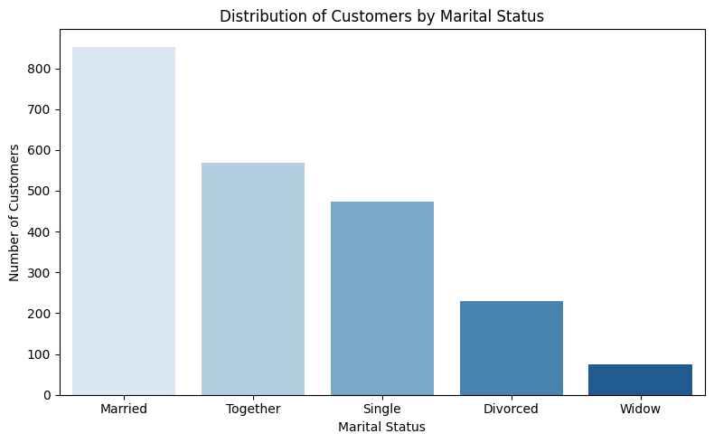
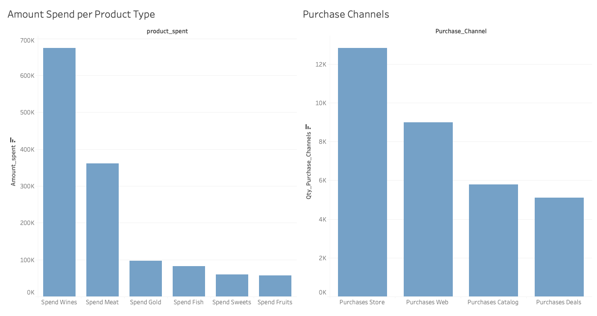
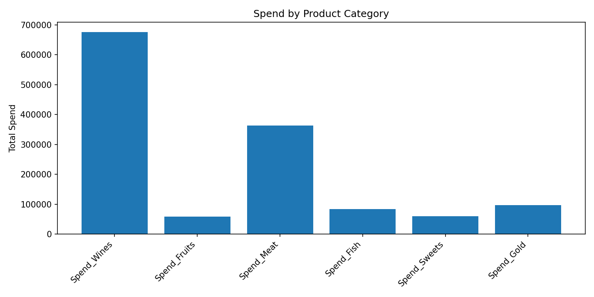
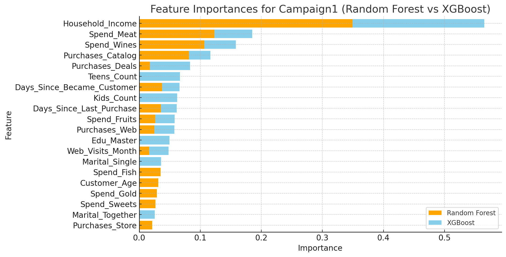
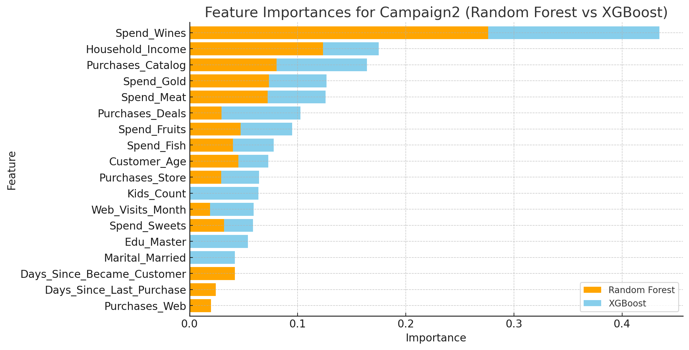
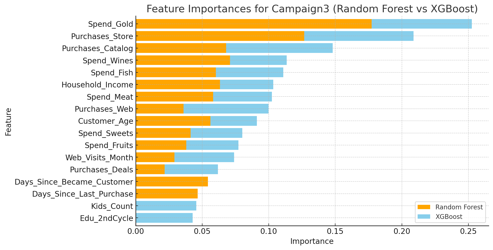
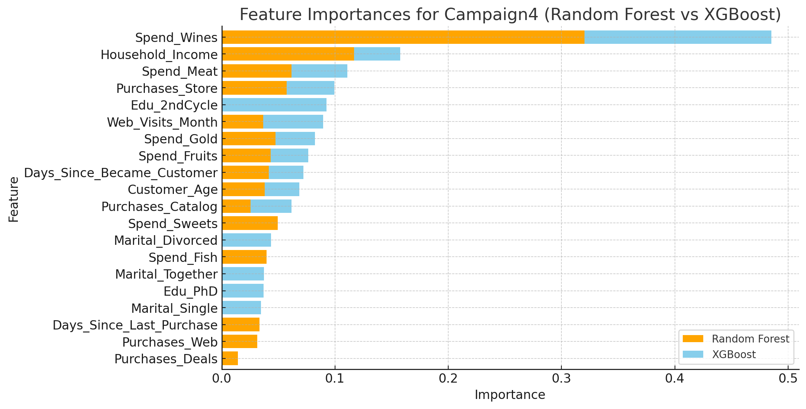
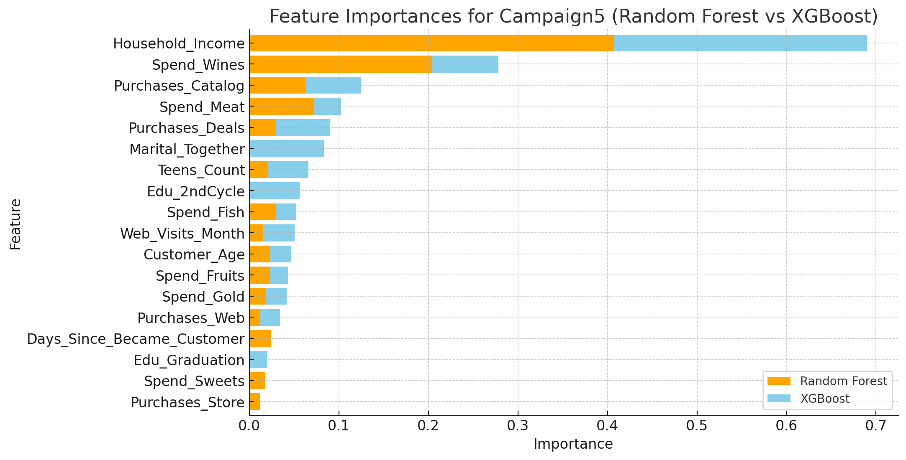
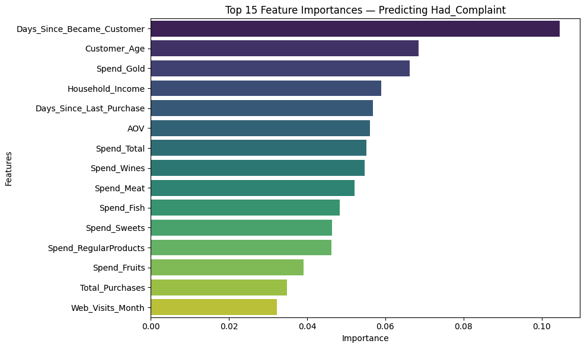

# Customer Segmentation & Campaign Response Analysis

## Table of Contents
1. [Executive Summary](#executive-summary)  
2. [Objectives & Business Problem](#objectives--business-problem)  
3. [Results](#results)  
4. [Methodology](#methodology)  
5. [Key Insights & Business Implications](#key-insights--business-implications)  
6. [Limitations & Next Steps](#limitations--next-steps)  
7. [Appendix / Technical Details](#appendix--technical-details)  

---

## Executive Summary

This project analyzes a retail marketing dataset to improve campaign targeting and customer segmentation.  
Using exploratory data analysis (EDA), feature engineering, and multiple machine learning models (Random Forest, XGBoost, Logistic Regression), we identified the key drivers of campaign acceptance and customer complaints, while building actionable segmentation strategies such as **RFM scoring**.

**Key Achievements:**
- Built segmentation models that highlight **high-income and wine-buying households** as the most responsive to marketing campaigns.  
- Designed a **6-category RFM framework** (Champions, Loyal Customers, Potential Loyalists, At Risk, Cold, Lost) to simplify customer retention and re-engagement strategies.  
- Discovered that **catalog and web engagement** consistently predict campaign acceptance across multiple campaigns.  
- Identified that **affluent, long-tenure customers** are both the most responsive and the most likely to complain, emphasizing the need for proactive relationship management.  
- Developed visual dashboards in Tableau to present findings in an executive-friendly format.  

---

## Objectives & Business Problem

The dataset represents thousands of customer records with demographics, purchase behavior, and responses to marketing campaigns.  
The company’s core challenge is **increasing campaign ROI** by better identifying which customers to target and how to engage them.  

**Business Questions:**
- Which customer attributes most influence campaign acceptance?  
- How can we segment customers into actionable groups to improve targeting?  
- What factors drive customer complaints, and how can they be reduced?  
- How do online vs. offline channels (web, catalog, store) affect responsiveness?  

**Objective:**  
To create a **data-driven segmentation and targeting framework** that improves marketing efficiency, boosts campaign conversion, and reduces customer dissatisfaction.

## Results

### Customers Profiles

## Average Age of Respondents by Campaign

The table below shows the average customer age for each campaign among those who **accepted** the offer, alongside the overall customer average for comparison:

| Group               | Average Age (years) |
|---------------------|----------------------|
| Overall Customers   | 51.1 |
| Campaign 1          | 51.6 |
| Campaign 2          | 51.9 |
| Campaign 3          | 48.6 |
| Campaign 4          | 54.0 |
| Campaign 5          | 50.3 |

**Insights:**  
- The overall customer base averages about **51.1 years old**.  
- Campaign 3 attracted slightly younger respondents on average.  
- Campaign 4 was most effective among older customers (around 54).  
- Campaigns 1, 2, and 5 landed in the early 50s range, showing consistency across those groups.

##  General Purchase Behavior

## Campaign Conversion Rates

An analysis of the conversion rates across the five campaigns revealed clear differences in customer responsiveness:

| Campaign   | Conversion Rate (%) |
|------------|----------------------|
| Campaign 4 | 7.45                 |
| Campaign 3 | 7.41                 |
| Campaign 5 | 7.32                 |
| Campaign 1 | 6.45                 |
| Campaign 2 | 1.36                 |

### Key Insights
- **Campaign 4** achieved the highest conversion rate (7.45%), closely followed by Campaigns 3 and 5.  
- **Campaign 1** performed moderately well at 6.45%.  
- **Campaign 2** showed the weakest performance (1.36%), indicating a significant gap compared to the others.  

### Interpretation
Campaigns 3, 4, and 5 were the most effective at engaging customers, suggesting that their design and targeting aligned better with customer interests. Campaign 2, however, may require a complete redesign or a shift in audience targeting to improve outcomes.

## Customer Re-Engagement

Re-engagement was measured at 30, 60, and 90 days after campaigns, capturing the percentage of customers who made a purchase within those windows.

| Time Window | Re-Engagement Rate (%) |
|-------------|-------------------------|
| 30 days     | 32.3                   |
| 60 days     | 61.6                   |
| 90 days     | 91.2                   |

### Key Insights
- About **one-third of customers (32.3%)** re-engaged within the first 30 days, indicating a strong short-term impact from campaigns.  
- Engagement continued to grow steadily, with **over 60% returning by 60 days**.  
- By **90 days, more than 9 in 10 customers (91.2%)** had re-engaged, suggesting campaigns had a long-lasting effect in maintaining customer relationships.  

### Interpretation
These results highlight that campaigns not only drive immediate responses but also sustain customer activity over time. The strong 90-day retention suggests that targeted follow-ups and loyalty programs could further maximize lifetime value.

## Logistic Regression Results Across Campaigns

### Business Insights

Across the five campaigns, logistic regression confirms several of the same drivers identified by tree-based models, while adding complementary perspective on how customer attributes shift the likelihood of campaign acceptance.

#### Campaign 1
- Household Income and Wine Spending are the strongest positive predictors, mirroring the dominance of income and wine in the tree-based models.  
- Catalog purchases and website visits also increase campaign acceptance, consistent with engagement as a recurring theme across models.  
- Negative signals like store purchases and fruit spending suggest traditional or low-margin channels are less effective, again in line with tree-based findings.  

#### Campaign 2
- Income, wine spending, and catalog purchases remain critical positive drivers, fully aligned with tree-based importance rankings.  
- Web activity (website visits) shows up as an additional positive signal.  
- Negative predictors such as fish, meat, and web purchases reinforce the idea that high online transaction activity doesn’t always translate into responsiveness to campaigns.  

#### Campaign 3
- Catalog purchases, gold product spending, and web visits emerge as the strongest positive drivers, confirming that high-value product engagement and digital activity are central to responsiveness.  
- Household income shows as a weaker or even negative predictor here, which may reflect multicollinearity effects rather than a true business pattern.  
- Catalog and luxury product buyers remain more receptive, giving confidence in targeting this segment.  

#### Campaign 4
- Wine spending and household income again lead, reinforcing their status as universal predictors across all models.  
- Positive contributions from web visits and catalog purchases strengthen the narrative that digital engagement is a reliable indicator of responsiveness.  
- Negative signals from meat, sweets, and children/teens count are consistent with tree-based models’ finding that larger families and everyday grocery spending correlate with lower campaign response.  

#### Campaign 5
- The most decisive positive drivers are household income and wine spending, perfectly aligned with Random Forest and XGBoost.  
- Gold and sweets spending also contribute positively, suggesting premium and indulgence product buyers are most receptive.  
- Negative associations with deals, marital status categories, and fish purchases further support the idea that discount-driven and family-oriented customers are less responsive.  

---

### Key Takeaways Across Campaigns
- **Consistent predictors**: Household income and wine spending stand out across all models and campaigns, making them the most reliable levers for targeting.  
- **Engagement signals**: Catalog purchases and web activity repeatedly emerge as positive drivers, highlighting the importance of omnichannel engagement.  
- **Less responsive segments**: Customers with higher family size, stronger focus on grocery/discount purchases, or heavy store reliance show weaker responses, confirming segmentation opportunities.  

---

## Campaigns Feature Importance – Tree-Based Models

#### Campaign 1
The strongest driver of response was household income, followed by spending on meat and wines. Customers with higher incomes and consistent grocery spending showed greater acceptance. Catalog purchases and deal sensitivity also played a role, indicating the campaign appealed to both loyal premium customers and promotion-driven buyers. Engagement metrics such as time since becoming a customer and recency of purchases reinforced this effect.  
**Insight:** Campaign 1 was most effective with long-term, high-income customers who regularly shop premium categories but also respond to deals.  

#### Campaign 2
Response was dominated by wine spending, with household income and catalog purchases as additional drivers. Customers with higher wine expenditure and stronger engagement in premium categories (e.g., gold, meat) were far more likely to accept the offer.  
**Insight:** Campaign 2 resonated most with premium and luxury-oriented customers, particularly heavy wine buyers. Positioning this type of campaign around exclusive wine or high-end offers will maximize results.  

#### Campaign 3
Key factors included store and catalog purchases, luxury spending (gold and wines), and household income. Meat and fish spend also mattered, along with customer age, which suggested stronger response among middle-aged customers with spending capacity.  
**Insight:** Campaign 3 succeeded with traditional store/catalog shoppers who purchase luxury consumables. Future campaigns should highlight exclusive in-store or catalog bundles, targeting these high-value segments.  

#### Campaign 4
The top driver was again wine spending, supported by household income. Other important factors included spending on meat and fruits, store purchases, and recency indicators such as web visits and customer tenure. Age also influenced results, suggesting demographic variation in responsiveness.  
**Insight:** Campaign 4 reached affluent wine and food category buyers with recent engagement, making it well suited for omnichannel strategies that combine in-store and online follow-ups.  

#### Campaign 5
Household income was by far the strongest driver, with wine spending and catalog engagement also highly predictive. Additional signals included meat and fish spending, age, and teens in the household, showing that family composition influenced responsiveness. Deal sensitivity was present but secondary.  
**Insight:** Campaign 5 was most effective among affluent, wine-buying households with families, particularly those engaged through the catalog channel. Scaling should focus on premium catalog offers tailored to high-income family households.  

### Overall Patterns Across Campaigns
- **Household income and spending on wines/meat** consistently defined responsiveness, highlighting the importance of affluent, premium buyers.  
- **Catalog channel engagement** was a recurring driver, showing that catalog customers are particularly responsive.  
- **Customer tenure and recency** mattered across multiple campaigns, confirming that engaged, long-standing customers are more likely to accept.  
- **Demographics such as age and household composition** occasionally emerged, suggesting targeted family-oriented opportunities.
- 

## Predicting Customer Complaints (Random Forest)

To understand which factors are most associated with customers filing complaints, we trained a Random Forest model using **Had_Complaint** as the target variable.  

### Top Feature Importances

### Key Insights
- **Tenure matters**: The strongest predictor of complaints was **Days Since Becoming a Customer**. Long-standing customers are more likely to escalate issues, perhaps reflecting higher expectations or accumulated frustrations over time.  
- **Demographics and profile**: **Customer Age** and **Household Income** were also highly influential. Older, higher-income customers tend to complain more, aligning with the profile of engaged premium buyers.  
- **Luxury spending as a signal**: Spending on **gold products** and overall high spend (Total, Wines, Meat) showed strong importance, suggesting that customers investing heavily in premium categories are more demanding.  
- **Engagement and recency**: **Days Since Last Purchase** and **Average Order Value (AOV)** also contributed, pointing to links between recent shopping behavior and complaint likelihood.  
- **Omnichannel patterns**: While not as dominant, **Total Purchases** and **Web Visits per Month** still ranked in the top 15, reinforcing that broad engagement is tied to complaint behavior.  

### Business Interpretation
Complaints are concentrated among **affluent, long-term, and high-spending customers**. This suggests that dissatisfaction is not random but often comes from the company’s most valuable clients — the ones with both the highest expectations and the greatest impact on brand reputation.  

**Actionable Implications:**
- Strengthen support and quality control for premium buyers and long-tenure customers.  
- Proactively monitor satisfaction among high-income and high-spend households.  
- Tailor complaint-resolution strategies to protect relationships with these critical segments.  

## Metodology

### Dataset Description

The raw dataset contains **2,205 customer records** with **39 features** covering demographics, purchase behavior, marketing campaign responses, and complaints.  

**Key feature groups:**
- **Demographics:**  
  - `Income`: Household yearly income.  
  - `Kidhome`, `Teenhome`: Number of children and teenagers in the household.  
  - `Age`: Customer age.  
  - `Customer_Days`: Number of days since becoming a customer.  
  - Marital status (one-hot encoded): `marital_Divorced`, `marital_Married`, `marital_Single`, `marital_Together`, `marital_Widow`.  
  - Education level (one-hot encoded): `education_2n Cycle`, `education_Basic`, `education_Graduation`, `education_Master`, `education_PhD`.  

- **Purchasing behavior (monetary values are yearly spending in each category):**  
  - `MntWines`, `MntFruits`, `MntMeatProducts`, `MntFishProducts`, `MntSweetProducts`, `MntGoldProds`.  
  - Aggregates: `MntTotal` (total spending), `MntRegularProds` (all products except gold).  

- **Purchasing channels:**  
  - `NumDealsPurchases`: Number of purchases with discounts.  
  - `NumWebPurchases`, `NumCatalogPurchases`, `NumStorePurchases`: Purchases by channel.  
  - `NumWebVisitsMonth`: Number of website visits per month.  

- **Marketing campaign responses:**  
  - `AcceptedCmp1`, `AcceptedCmp2`, `AcceptedCmp3`, `AcceptedCmp4`, `AcceptedCmp5`: Binary indicators of acceptance for five campaigns.  
  - `Response`: General campaign response flag.  
  - `AcceptedCmpOverall`: Total number of campaigns accepted.  

- **Customer feedback:**  
  - `Complain`: Indicates whether the customer filed a complaint.  

- **Other technical fields:**  
  - `Z_CostContact`, `Z_Revenue`: Constant columns (same value for all customers, removed during cleaning).  

**Summary:**  
This dataset provides a comprehensive view of customer demographics, engagement, and purchase behavior across multiple channels, as well as their responsiveness to marketing campaigns. It is well-suited for customer segmentation, campaign targeting, and churn/complaint prediction.
