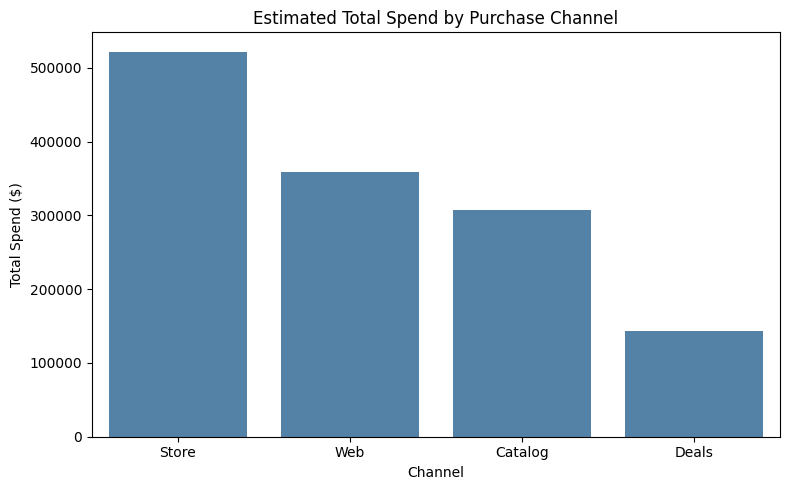
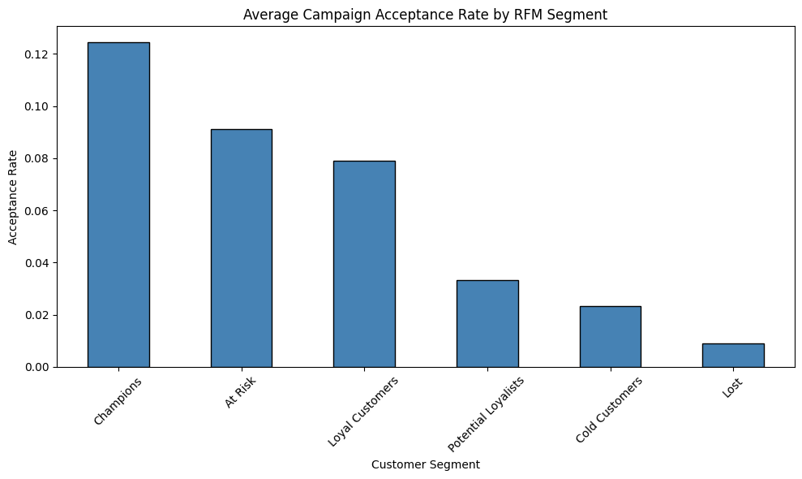
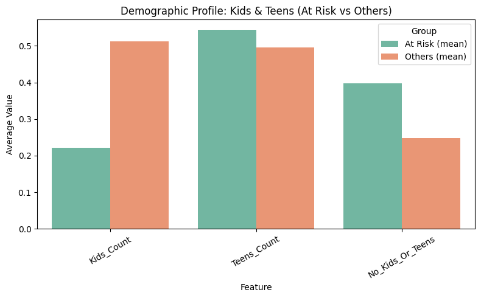
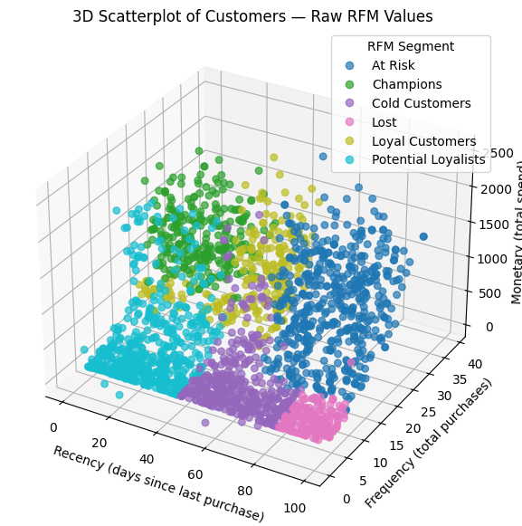

# Customer Segmentation & Campaign Response Analysis

## Table of Contents
1. [Executive Summary](#executive-summary)  
2. [Objectives & Business Problem](#objectives--business-problem)  
3. [Results & Business Insights](#results--business-insights)  
   - [Customer Profiles](#customer-profiles)  
   - [General Purchase Behavior](#general-purchase-behavior)  
   - [Campaign Performance](#campaign-performance)  
   - [Modeling Campaign Responses](#modeling-campaign-responses)  
   - [Campaign Acceptance by RFM Segment](#campaign-acceptance-by-rfm-segment)  
   - [Key Insight: At-Risk Clients Respond to Campaigns](#key-insight-campaign-susceptibility-of-at-risk-clients)  
   - [Demographic Insight: At-Risk Clients Have Fewer Children](#demographic-insight-at-risk-clients-have-fewer-young-children)  
   - [Predicting Customer Complaints](#predicting-customer-complaints)  
   - [Overall Business Takeaway](#overall-business-takeaway)  
4. [Methodology](#methodology)  
5. [Skills Demonstrated](#skills-demonstrated)  
6. [Limitations & Next Steps](#limitations--next-steps)    

---

## Executive Summary

Retail marketing campaigns often struggle with low and inconsistent response rates, making it difficult to allocate resources effectively and maximize ROI. The core challenge for the business is to **understand what makes a campaign successful and which customer segments are most likely to engage**, so that future campaigns can be designed with higher precision and impact.

This project analyzed a comprehensive customer dataset of demographics, purchase behavior, and campaign responses to uncover the key drivers of campaign acceptance and customer complaints. By combining **exploratory data analysis (EDA)**, **feature engineering**, and **machine learning models** (Random Forest, XGBoost, Logistic Regression), we developed a data-driven framework to improve campaign targeting and customer understanding.

**Key Achievements:**
- Identified **household income, wine spending, and catalog/web engagement** as the most reliable predictors of campaign success.  
- Built a **6-category RFM segmentation framework** (Champions, Loyal Customers, Potential Loyalists, At Risk, Cold, Lost) to guide retention and re-engagement strategies.  
- Found that **affluent, long-tenure customers** are the most likely to complain, underscoring the need for proactive service strategies to protect high-value relationships.  
- Created **visual dashboards in Tableau** to present results in an executive-friendly format, making insights actionable for decision-makers.  
- Demonstrated how optimizing campaign targeting could **increase conversion rates by focusing on high-income, premium-product buyers**, while reducing wasted spend on less responsive segments.  

**Next Steps:**  
Future work should expand into **personalized offer design**, test **channel-specific strategies** (web, catalog, store), and integrate **real-time customer feedback** to further refine targeting and reduce complaint rates.  

---

## Objectives & Business Problem

The dataset contains thousands of customer records with demographics, purchase behavior, and responses to multiple marketing campaigns.  
The business challenge is to **uncover what drives campaign success and build a clearer understanding of customer behavior** to guide future marketing strategies.

**Business Questions:**
- Which customer attributes most influence whether a campaign is accepted?  
- How can customers be segmented into actionable groups for targeting, retention, and re-engagement?  
- What factors are linked to customer complaints, and how can they be addressed to protect high-value relationships?  
- How do online and offline channels (web, catalog, store) differ in shaping responsiveness?  

**Objective:**  
To create a **data-driven segmentation and targeting framework** that strengthens campaign effectiveness, improves customer engagement, and reduces dissatisfaction.

---

## Results & Business Insights

This section combines the analytical results with their business implications, presenting a complete story from customer profiling to campaign performance, modeling outcomes, and complaint prediction.

---

### Customer Profiles  

#### Average Age of Respondents by Campaign  
The table below shows the average customer age for each campaign among those who **accepted** the offer, alongside the overall customer average for comparison:

| Group               | Average Age (years) |
|---------------------|----------------------|
| Overall Customers   | 51.1 |
| Campaign 1          | 51.6 |
| Campaign 2          | 51.9 |
| Campaign 3          | 48.6 |
| Campaign 4          | 54.0 |
| Campaign 5          | 50.3 |

**Insights:**  
- The customer base averages around **51.1 years old**.  
- Campaign 3 drew in slightly younger clients.  
- Campaign 4 appealed more to older customers (~54 years).  
- Campaigns 1, 2, and 5 showed consistent engagement across the low-50s range.

#### Demographic Distribution  
  
  
  

---

### General Purchase Behavior  

  
  

---

### Campaign Performance  

#### Conversion Rates  
| Campaign   | Conversion Rate (%) |
|------------|----------------------|
| Campaign 4 | 7.45                 |
| Campaign 3 | 7.41                 |
| Campaign 5 | 7.32                 |
| Campaign 1 | 6.45                 |
| Campaign 2 | 1.36                 |

**Key Insights:**  
- Campaigns 4, 3, and 5 performed best.  
- Campaign 1 was moderate.  
- Campaign 2 underperformed significantly.

**Implications:**  
- Replicate strategies from Campaigns 3–5.  
- Reassess Campaign 2 completely (offer, message, targeting).

#### Re-Engagement  
| Time Window | Re-Engagement Rate (%) |
|-------------|-------------------------|
| 30 days     | 32.3                    |
| 60 days     | 61.6                    |
| 90 days     | 91.2                    |

**Insights:**  
- One-third of users returned within 30 days.  
- Over 90% re-engaged within 90 days.

**Implications:**  
- Campaigns drive both short-term and long-term customer retention.

---

### Modeling Campaign Responses  

#### Logistic Regression Highlights  
- **Income** and **wine spending** are the strongest predictors across all campaigns.  
- **Catalog and web activity** boost response.  
- **Store, grocery, and discount-oriented behavior** reduce response.

#### Tree-Based Models (Random Forest & XGBoost)  
Reaffirmed the same trends:
- Income, wine, catalog/web use = high response  
- Grocery, large households = low response  

  
  
  
  
  

**Business Implications:**  
- Focus campaigns on **affluent, digitally engaged customers**.  
- Leverage catalog and wine as both **product and engagement drivers**.  
- Limit budget on store/grocery-heavy segments with weak ROI.

---

### Campaign Acceptance by RFM Segment  

| Segment              | Acceptance Rate (%) |
|----------------------|----------------------|
| Champions            | ~12.5                |
| At Risk              | ~9.0                 |
| Loyal Customers      | ~8.0                 |
| Others (Cold/Lost)   | 1–3                  |

## Key Insight: Campaign Susceptibility of At-Risk Clients

At Risk customers show a **surprisingly high response** to marketing campaigns — nearly as strong as Champions.

With well-timed, targeted campaigns, these customers could be reactivated before churn, improving retention at low cost.

---

## Demographic Insight: At-Risk Clients Have Fewer Young Children

At Risk clients tend to have **fewer small children**, are **more likely to have teens**, or **no children at all**.

This suggests they may be more receptive to **convenience- and self-focused offers**, rather than family-centric messaging.

---

### Predicting Customer Complaints  

A Random Forest model identified the top features associated with complaints.

  

**Key Insights:**  
- Complaints come mostly from **high-income, long-tenure customers**.  
- These are **valuable clients** with high expectations.  

**Implication:**  
- Handling complaints well is a **retention strategy**, especially for top-tier customers.

---

### Overall Business Takeaway

- Campaigns succeed when targeting **affluent, premium, digital customers**.  
- **Wine and catalog engagement** are strong ROI levers.  
- **At Risk clients** can be reactivated with tailored campaigns.  
- **Complaint resolution** is crucial for retaining **high-value, long-term clients**.

## Methodology

### Dataset Description

The raw dataset contains **2,205 customer records** with **39 features** covering demographics, purchase behavior, marketing campaign responses, and complaints.  

**Key feature groups:**
- **Demographics:**  
  - `Income`: Household yearly income.  
  - `Kidhome`, `Teenhome`: Number of children and teenagers in the household.  
  - `Age`: Customer age.  
  - `Customer_Days`: Number of days since becoming a customer.  
  - Marital status (one-hot encoded): `marital_Divorced`, `marital_Married`, `marital_Single`, `marital_Together`, `marital_Widow`.  
  - Education level (one-hot encoded): `education_2n Cycle`, `education_Basic`, `education_Graduation`, `education_Master`, `education_PhD`.  

- **Purchasing behavior (monetary values are yearly spending in each category):**  
  - `MntWines`, `MntFruits`, `MntMeatProducts`, `MntFishProducts`, `MntSweetProducts`, `MntGoldProds`.  
  - Aggregates: `MntTotal` (total spending), `MntRegularProds` (all products except gold).  

- **Purchasing channels:**  
  - `NumDealsPurchases`: Number of purchases with discounts.  
  - `NumWebPurchases`, `NumCatalogPurchases`, `NumStorePurchases`: Purchases by channel.  
  - `NumWebVisitsMonth`: Number of website visits per month.  

- **Marketing campaign responses:**  
  - `AcceptedCmp1`, `AcceptedCmp2`, `AcceptedCmp3`, `AcceptedCmp4`, `AcceptedCmp5`: Binary indicators of acceptance for five campaigns.  
  - `Response`: General campaign response flag.  
  - `AcceptedCmpOverall`: Total number of campaigns accepted.  

- **Customer feedback:**  
  - `Complain`: Indicates whether the customer filed a complaint.  

- **Other technical fields:**  
  - `Z_CostContact`, `Z_Revenue`: Constant columns (same value for all customers, removed during cleaning).  

**Summary:**  
This dataset provides a comprehensive view of customer demographics, engagement, and purchase behavior across multiple channels, as well as their responsiveness to marketing campaigns. It is well-suited for customer segmentation, campaign targeting, and churn/complaint prediction.

This project followed a structured analytics workflow, moving from raw data exploration to advanced modeling and business interpretation. The technical implementation is fully documented in the Jupyter Notebooks (see repository), while the summary below outlines the key steps.

---

### 1. Data Understanding & Cleaning
- Explored the raw dataset of **2,205 customer records and 39 features**, covering demographics, purchase behavior, marketing campaigns, and complaints.  
- Identified and addressed inconsistencies:
  - Removed constant columns (`Z_CostContact`, `Z_Revenue`) with no analytical value.  
  - Corrected `Spend_Total` to include gold product spending.  
  - Renamed columns for clarity and consistency (e.g., `Kidhome → Kids_Count`, `Teenhome → Teens_Count`).  
- Checked distributions and detected skewness across spending variables.  
- Handled outliers using boxplot inspections and domain-driven thresholds.

---

### 2. Exploratory Data Analysis (EDA)
- Visualized distributions of income, age, and spending categories.  
- Correlation and heatmap analysis revealed strong relationships between spending categories.  
- Conducted bivariate analysis (e.g., income vs. wine, frequency vs. monetary value).  
- Derived early insights into high-income, wine-buying households as key drivers of engagement.  

---

### 3. Feature Engineering
- **Campaign Metrics:**  
  - Calculated individual campaign conversion rates.  
  - Built customer-level re-engagement metrics (30, 60, 90 days).  

- **RFM Segmentation:**  
  - Applied Recency, Frequency, Monetary scoring using quintiles (1–5).  
  - Created six actionable customer segments: Champions, Loyal, Potential Loyalists, At Risk, Cold, and Lost.
 

- **Additional Features:**  
  - Calculated Average Order Value (AOV).  
  - Aggregated total purchases and channel usage indicators.  

---

### 4. Multicollinearity & Scaling
- Conducted **Variance Inflation Factor (VIF) analysis** to drop redundant features and reduce multicollinearity.  
- Applied **Yeo-Johnson transformations** to correct skewness in heavily skewed spending variables.  
- Implemented **scaling pipeline**:
  - Standardized continuous variables.  
  - Passed through binary variables without transformation.  
- Produced a final **scaled feature dataset** for modeling.

---

### 5. Modeling
- **Random Forest & XGBoost:**  
  - Feature importance analysis across all five campaigns.  
  - Confirmed household income, wine spending, catalog engagement, and web visits as consistent predictors of acceptance.  

- **Logistic Regression:**  
  - Validated tree-based findings while offering interpretability.  
  - Showed positive predictors (income, wine, catalog/web activity) and negative predictors (store/grocery spending, larger households).  
  - Evaluated with ROC-AUC and Precision-Recall AUC.  

- **Customer Complaints Model:**  
  - Built a Random Forest to predict complaint likelihood.  
  - Found tenure, income, age, and luxury spending as top drivers of complaints.  

---

### 6. Visualization & Business Storytelling
- Built Tableau dashboards for executive-ready insights:  
  - Campaign conversion and re-engagement.  
  - Purchase channel and product-type distributions.  
  - Segmentation by marital status, education, and household composition.  
- Produced complementary plots in Jupyter (matplotlib/seaborn) for profiling and model interpretability.

---

### 7. Documentation
- Full workflow is presented in **two Jupyter Notebooks**:  
  1. **EDA Notebook:** Data cleaning, exploration, outlier detection, and feature corrections.  
  2. **Modeling Notebook:** Feature engineering, scaling, modeling (Random Forest, XGBoost, Logistic Regression), and evaluation.  

Links to notebooks are included in the repository for technical review.

## Skills Demonstrated

This project required a combination of **technical, analytical, and business storytelling skills** to transform raw customer data into actionable marketing insights.  

**Data Preparation & Cleaning**
- Processed a dataset of 2,205 customer records with 39 features.  
- Renamed, reformatted, and corrected variables for clarity and accuracy.  
- Detected and handled outliers in spending and income distributions.  
- Removed redundant/constant columns and validated data integrity.  

**Exploratory Data Analysis (EDA)**
- Conducted univariate and bivariate analysis to identify spending and demographic trends.  
- Visualized customer profiles by age, marital status, education, and household composition.  
- Explored relationships between income, product spending, and purchase channels.  

**Feature Engineering**
- Created new features such as **Average Order Value (AOV)**, **Total Purchases**, and channel usage indicators.  
- Built **RFM scores** and translated them into six actionable customer segments.  
- Computed campaign conversion and re-engagement metrics.  

**Statistical & Machine Learning Modeling**
- Applied **Random Forest** and **XGBoost** for feature importance analysis across five campaigns.  
- Used **Logistic Regression** for interpretability and validation of drivers.  
- Built a **Random Forest model** to predict likelihood of customer complaints.  
- Addressed multicollinearity with **VIF analysis** and corrected skewness with **Yeo-Johnson transformations**.  

**Visualization & Storytelling**
- Produced custom plots in Python (matplotlib, seaborn) to profile demographics, purchases, and campaign results.  
- Designed charts to highlight key patterns such as conversion rates, re-engagement, and complaint drivers.  
- Structured findings into a cohesive **business narrative** that connects technical results to strategic decisions.  

**Business Insight Generation**
- Identified **income, wine spending, and catalog/web engagement** as universal campaign success drivers.  
- Flagged underperforming campaign strategies and provided redesign recommendations.  
- Highlighted complaint risk among affluent, long-tenure customers, reframing service quality as a strategic retention lever.  

**Tools & Technologies**
- **Python:** pandas, numpy, matplotlib, seaborn, scikit-learn, XGBoost  
- **Jupyter Notebooks:** Documented workflow for EDA and modeling

## Limitations & Next Steps

**Limitations**  
- **No time-series data:** The dataset did not include detailed transaction timestamps beyond aggregate counts and recency measures. This limited the ability to perform advanced temporal analyses such as seasonality, campaign timing effects, or customer lifetime value modeling.  
- **Small dataset size:** With only 2,205 customer records, the sample may not fully represent the diversity of the broader customer base. Model results could vary significantly if applied to larger or more heterogeneous populations.  
- **Aggregated variables:** Many features (e.g., yearly spending by category, total purchases by channel) were already aggregated, reducing granularity. This prevented finer-grained insights, such as detecting purchase sequences or shifts in behavior over time.  
- **Limited campaign information:** While responses to five campaigns were included, the dataset lacked details on campaign content (offer type, discount, creative design), which are crucial for fully understanding performance differences.  

**Next Steps**  
1. **Collect transactional-level data** with timestamps to enable time-series modeling, churn prediction, and lifetime value forecasting.  
2. **Expand dataset size and scope** to include a broader customer base, improving generalizability of segmentation and predictive models.  
3. **Integrate campaign metadata** (channel spend, creative design, discount levels) to better link campaign characteristics to customer response.  
4. **Personalization modeling:** Build recommender systems that suggest tailored offers based on past purchases and engagement.  
5. **Deploy models in production:** Operationalize campaign response and complaint prediction models within a CRM or marketing automation platform.  
6. **A/B testing of campaigns:** Use insights from this analysis to design experiments that test high-value targeting strategies (e.g., wine-focused catalog offers to affluent segments).  

By addressing these limitations and pursuing the outlined next steps, the company can transition from retrospective analysis to **predictive and prescriptive marketing strategies**, ultimately driving higher engagement, retention, and campaign ROI.  
